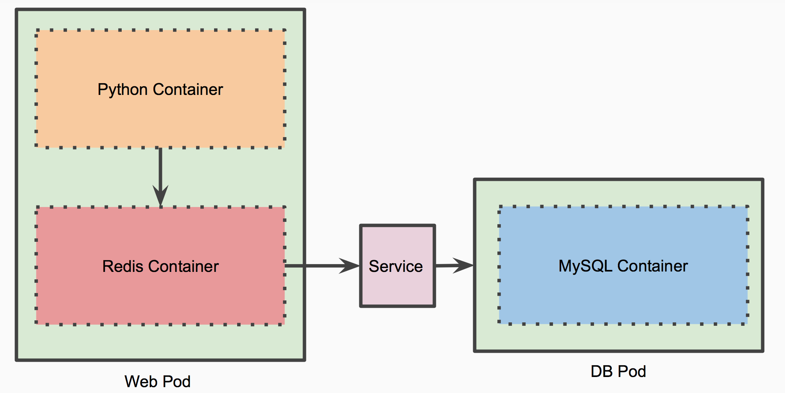

### Multi-Container Pod Tutorial

This tutorial demonstrates how to package multiple containers into a single pod using Kubernetes.

#### Architecture Overview

The application is structured into two main pods:

- **Web Pod**: This pod contains two containers—a Python Flask container and a Redis container. The Python Flask application serves a REST API. When data is requested through this API, it first checks the Redis cache before accessing the MySQL database. If the data is retrieved from MySQL, it is then cached in Redis for future requests.

- **DB Pod**: This pod hosts a MySQL container, which serves as the primary database for the application.

When additional Web Pods are launched (manually or via a ReplicaSet), they deploy co-located pairs of Python Flask and Redis containers. This ensures that the Flask application and its corresponding Redis cache operate together.




#### Workflow

1. **Deploy the Application to Kubernetes**:
    ```bash
    cd ../Deploy
    kubectl create -f db-pod.yml
    kubectl create -f db-svc.yml
    kubectl create -f web-pod-1.yml
    kubectl create -f web-svc.yml
    ```

2. **Verify Pods and Services**:
    ```bash
    kubectl get pods
    kubectl get svc
    ```

3. **Access the Web Service**:
    - Get the IP address of one of the nodes and the NodePort for the web service:
      ```bash
      kubectl get nodes
      kubectl describe svc web
      export NODE_IP=<NODE_IP>
      export NODE_PORT=<NODE_PORT>
      ```

4. **Initialize the Database with Sample Schema**:
    ```bash
    curl http://$NODE_IP:$NODE_PORT/init
    ```

5. **Insert Sample Data**:
    ```bash
    curl -i -H "Content-Type: application/json" -X POST -d '{"uid": "1", "user":"Aakash M"}' http://$NODE_IP:$NODE_PORT/users/add
    curl -i -H "Content-Type: application/json" -X POST -d '{"uid": "2", "user":"Fredrick K"}' http://$NODE_IP:$NODE_PORT/users/add
    curl -i -H "Content-Type: application/json" -X POST -d '{"uid": "3", "user":"Alexandre P"}' http://$NODE_IP:$NODE_PORT/users/add
    curl -i -H "Content-Type: application/json" -X POST -d '{"uid": "4", "user":"Mike Taylor"}' http://$NODE_IP:$NODE_PORT/users/add
    ```

6. **Access the Data**:
    - Initially:
      ```bash
      curl http://$NODE_IP:$NODE_PORT/users/1
      ```
    - On subsequent requests, notice the '(c)' appended to indicate data is retrieved from the Redis cache:
      ```bash
      curl http://$NODE_IP:$NODE_PORT/users/1
      ```

